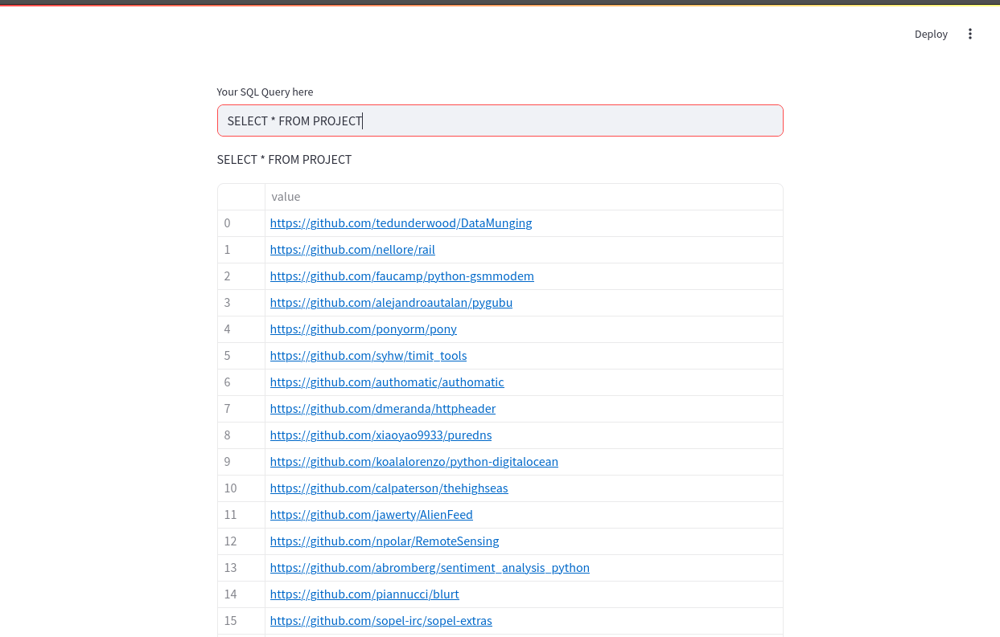

# Ad-Hoc Parser Truth

## Dataset Population Script (SQLite)

### Run Commands

```bash
cd dataset_population/
```

```bash
pip install -r requirements.txt
```

```bash
python3 ./populate_db.py
```

## Web App (Streamlit)

```bash
cd web-app/
```

```bash
pip install -r requirements.txt
```

```bash
streamlit run app.py
```

or

```bash
python3 -m streamlit run app.py
```



## Python Environment

create:

```bash
source .venv/bin/activate

pip install -r requirements.txt
```

return to normal shell:

```bash
deactivate
```
