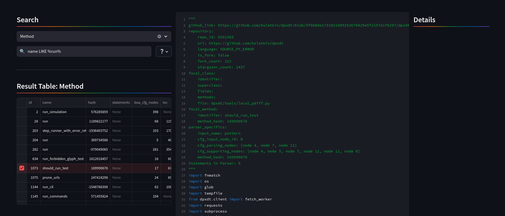
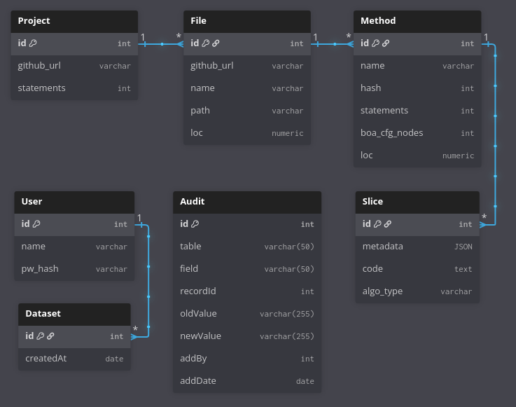

# Ad-Hoc Parser Truth

A tool to analyze ad-hoc string parsers from Python code snippets as part of the TYPES4STRINGS project.

It consists of a database population script and a web app.
The population script takes a dataset of ad hoc parsers, consisting of a CSV and a file structure of code snippets. As a result of this script, a SQLite database is generated/populated. For a detailed description, refer to the [Populate Database](#populate-database) section.

The Streamlit web app visualizes the data and makes it searchable. The affiliation of projects to files and to the extracted code snippets is visualized in a tree-like structure. Combined with the code and metadata information, all at one glance. Further details on starting the web app can be found in the [Web App](#web-app) section.

This tool can be seen as a first iteration. With further development, it can be used for annotating these ad hoc parsers with ground truth, resulting in a benchmark dataset that can be used for analyzing parsing programs.



## Requirements

- Minimum Python version `3.10`

## Populate Database

### Prerequisites

#### Initial User

An initial user must be set. This is a user who is saved in the database's `User` table. This user needs to be configured in `config.py`, located in the root folder, before the database population script is executed. For this, the config variables `INITIAL_USER_NAME` and `INITIAL_USER_PW_HASH` are relevant.

#### Dataset

- For the default configuration, the source for the population script needs to be saved in the `data` folder, named `analysis_results.csv`. The CSV needs to be saved directly under the `data` folder. If the CSV is named differently or saved under another location, the variable `CSV_DATA_PATH` in the `config.py` can be changed according to your needs.

- wie soll das csv ausschauen
  - mit einem Beispiel csv abgespeichert in data/example
==TODO== :warning:

  - hier trotzdem in einer Tabelle alle Spalten aufzählen, beschreiben, welcher Daten Typ

- The path for the code of the parser slices needs to be specified in the CSV in a column called `file`. (snippets from the original method as the annotated code)

- The original code from the methods must be located under the `data/ParserExamples/original_methods` folder.
==TODO== :warning:

### Dataset Population Script

==TODO== :warning:

- nur wenn noch kein adhocparser.db file in data existiert werden Tabellen erstellt und initial User hinzugefügt

- and  is allowed to add datasets to the database

#### Parameter

- `<importedBy>` ==TODO== :warning:
  - The name of the user that is linked to the populated dataset. The user has to exist in the `User` table of the database.

#### Run Commands

```bash
cd dataset_population/
```

```bash
pip install -r requirements.txt
```

```bash
python3 ./populate_db.py <importedBy>
```

## Database Schema



## Web App

### Start Web App

```bash
cd web-app/
```

```bash
pip install -r requirements.txt
```

```bash
streamlit run app.py
# or
python3 -m streamlit run app.py
```

### Search

explain search input field, what is allowed, what is searched ==TODO== :warning:

## Open Topics

Open topics are tracked as [GitHub Issues](https://github.com/ipa-lab/parser-truth/issues).
