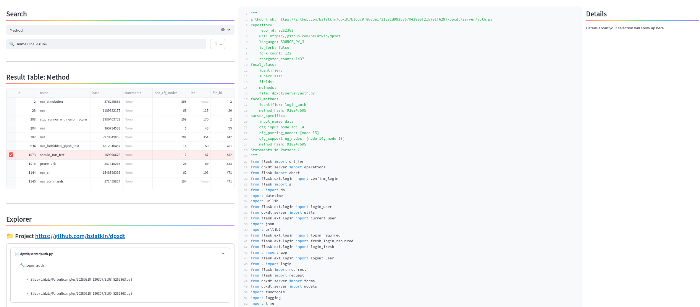
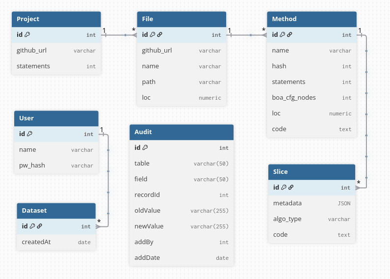
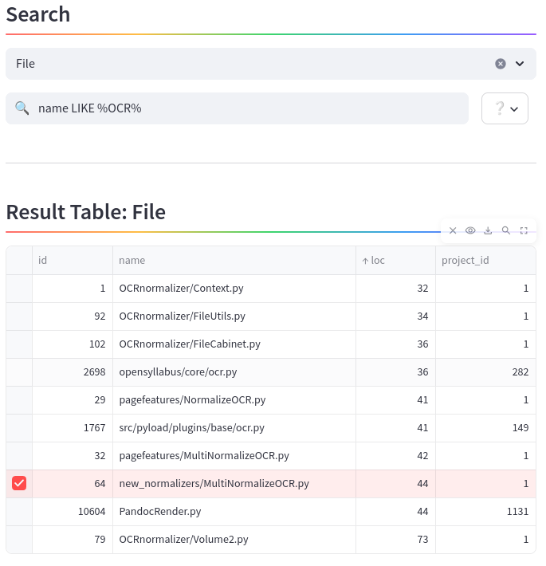

# Parser Truth

[Prerequisites](#prerequisites) | [Dataset Population Script](#dataset-population-script) | [Database Schema](#database-schema) | [Start Script `parser-truth.sh`](#start-script-parser-truthsh) | [Search Feature explained](#search-explained)

A tool to analyze ad-hoc string parsers from Python code snippets as part of the TYPES4STRINGS project.

It consists of a database population script and a web app. The population script takes a dataset of ad hoc parsers, consisting of a CSV and a file structure of code snippets. As a result of this script, a SQLite database is generated/populated. The Streamlit web app visualizes the data and makes it searchable. The affiliation of projects to files and to the extracted code snippets is visualized in a tree-like structure. Combined with the code and metadata information, all at one glance.

This tool can be seen as a first iteration. With further development, it can be used for annotating these ad hoc parsers with ground truth, resulting in a benchmark dataset that can be used for analyzing parsing programs.

## Requirements

- Minimum Python version `3.10`
- Minimum Caddy version `2.10.2`
- other dependencies are configured in `requirements.txt` files

## Prerequisites

### Initial User

An initial user must be set. This is a user who is saved in the database's `User` table. This user needs to be configured in `config.py`, located in the root folder, before the database population script is executed. For this, the config variables `INITIAL_USER_NAME` and `INITIAL_USER_PW_HASH` are relevant.

### Dataset

For the default configuration, the source (dataset) for the population script needs to be saved in the `data` folder, named `analysis_results.csv`. The CSV needs to be saved in the `data` folder. If the CSV is named differently or saved under another location, the variable `CSV_DATA_PATH` in `config.py` can be changed according to your needs.

To populate the dataset into the database, it needs to be in a specific format (eg., specific column names). An example of a well-formatted, accepted dataset is provided in `data/analysis_results.csv`. This is how the dataset needs to look for the currently implemented population script.

In addition to the CSV, two things are important regarding the method and slice code:

- The paths where the code of the parser slices are located need to be specified in the column called `file` in the CSV.
  - This should be the code snippets from the original method (annotated code).
  - At the time the population script is called, the code files need to be available on the given path.
  - The paths must be specified relative to the script location.
- In the current implementation, the paths where the original method codes are located are derived from the slice paths.
  - For example, when the slice path is
    `../data/ParserExamples/XXX/YYY.py`,
    the method code will be searched for under the path
    `../data/ParserExamples/XXX/original_methods/YYY.py`.

## Start Script `parser-truth.sh`

For an easy start of the application with all the requirements, there exists the `parser-truth.sh` script in the root folder. The script covers the following commands:

- **Virtual Python Environment:** First, it creates a virtual environment to easily install dependencies isolated to the project.
- **Installation of Requirements:** All the necessary requirements are configured in dedicated `requirements.txt` files.
- **Execution of Dataset Population Script:** Runs `./populate_db.py` with default parameter, described in detail in the next section.
- **Start of Streamlit App:** Starts the app on the specific sub path `parser-truth`. For local execution, this means that the application is available at `localhost:8501/parser-truth`.

For manual execution, one can find all the handy commands in this script.

## Dataset Population Script

The Python script needs the requirements specified in the dedicated `/dataset_population/requirements.txt` file.
Following command is needed (executed from `/dataset_population` folder):

``python3 ./populate\_db.py [importedBy]``

### Parameter

- `importedBy`
  - Name of the user that will be linked to the populated dataset.
  - The user has to exist in the `User` table of the database.
  - In the start script, this parameter is set to the value `truthUser`, which is the initial user set per default as `INITIAL_USER_NAME` in `config.py`.

### What the script exactly does:

- Creates all tables (see database schema below) (only if no `/data/adhocparser.db` already exists).
- Adds the initial user from the `config.py` configuration into the `User` table (only if no `/data/adhocparser.db` already exists).
- Links the `importedBy` user to the dataset, by adding an entry in the `Dataset` table.
- Table per table, inserts the data from the dataset and creates the respective relationships.
- In the `Slice` table, it bundles the slice-specific metadata in a JSON object and saves it as `metadata` property in the database.
- Takes the code from methods and slices from the respective files and saves them as the `code` property with datatype string (for easy access of the code snippets without any I/O operation later).

The script is included as part of the start script, but it can also be executed manually during the application run to add new datasets to the database.

## Database Schema

The figure bellow shows the database schema. This is how the dataset will be structured when it is populated in the database. Additionally, the database reflects the user management, thus the connection between users adding a new dataset. The relationships and structure of the database are chosen for easy queries for the application's common use cases.

The figure also shows the `Audit` table, which covers the change management in the database. However, due to the limited scope of the project, the change management has not yet been implemented, except for the creation of the table.

## Search explained

The currently implemented search available in the web app allows a simple and fast displaying and filtering of the data. After table selection or hitting enter in the input field, the search is triggered and shows the result in a table. This can also be seen in the figure bellow. With the Streamlit built-in table features, the search result is sortable.

In the current state of the application the search feature is limited to two parts:

- drop down for table name
- text input filed for a search parameter

These inputs results in a query in the form of

`SELECT * FROM [selected table name] WHERE [search parameter];`.

`search parameter` &ensp; ... &ensp; `[column name] [operator] [value]`

where

`operator` &ensp; ... &ensp; `[ = | LIKE | > | < | >= | <= | != | <> ]`

`value` &ensp; &ensp; &ensp; ... &ensp; number or word

  

## Open Topics

Open topics (for example change management, advanced search, ...) are tracked as [GitHub Issues](https://github.com/ipa-lab/parser-truth/issues).
